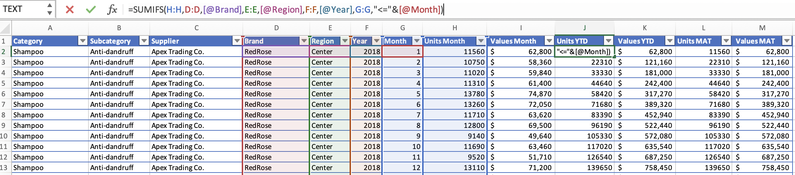
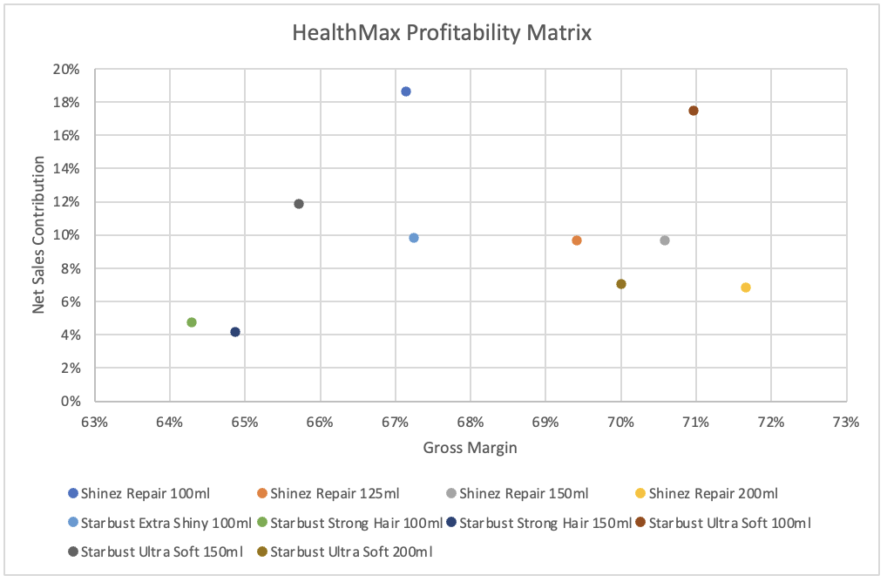
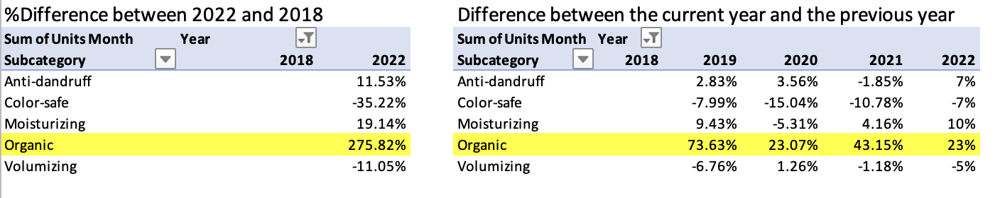
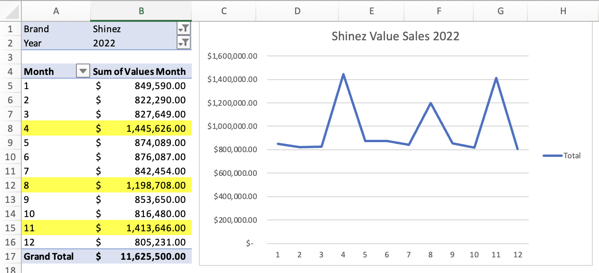
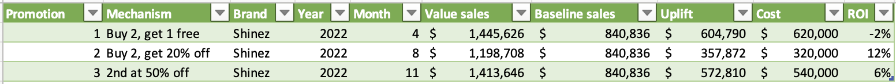
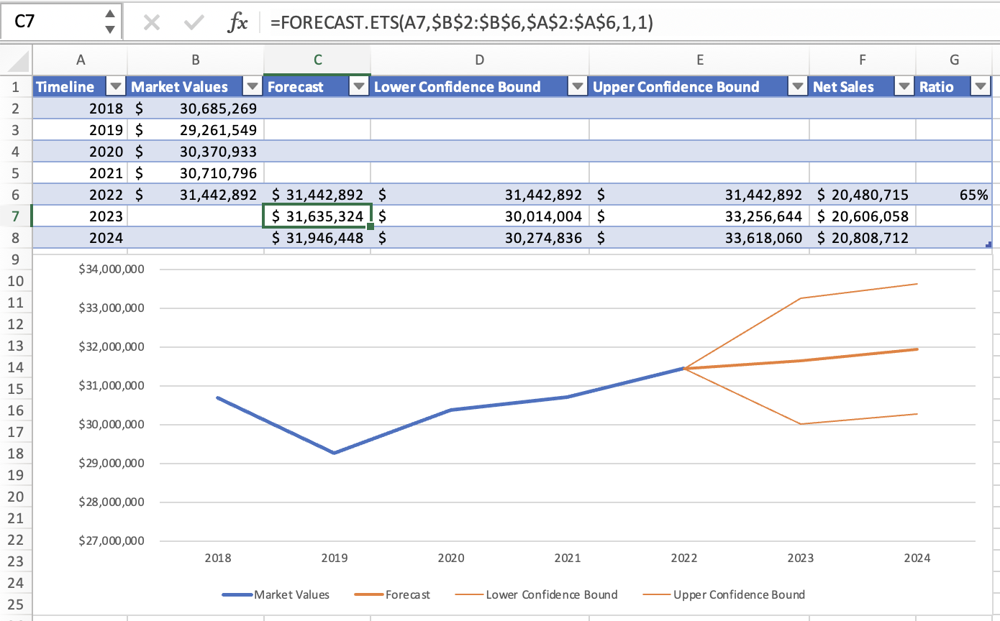

# Excel Case Study-Net Revenue Management

## Business Simulation

- In this case, we’ll analyze a business simulation of HealthMax company in the shampoo industry via a fictitious data source.
- There are 5 shampoo subcategories like Anti-dandruff, Color-safe, Moisturizing, Organic, and Volumizing in the market. HealthMax is only active in 2 subcategories: (1) Anti-dandruff (Shinez brand) and (2) Volumizing (Starbust brand).

## Dataset Description

- **external_sales_data.csv** includes the sales of all the brands, with a split per region, subcategory, and supplier. The sales are available per month in unit and value sales, ranging from January 2018 to March 2023.
- **internal_sales_data.csv** shows the sales results of HealthMax Company in 2022.
- **new_products_launch.csv** shows information on two new products that are considered to launch in 2024.
- **promotion_analysis.csv** shows the information on 3 promotion campaigns in 2022.

## Conclusions and Recommendations

- The total sales value in the shampoo industry in 2022 is $93,997,886. HealthMax was the top 1 supplier with 33.45% market share.
- HealthMax Value Sales per brand and year showed that their business growth increased sustainably through 2018-2022.
- From the Profitability Matrix, `Shinez Repair 200ml and Starbust Ultra Soft 100ml are the two most profitable products in their assortment to be considered for investment`.
- There are 5 shampoo subcategories like Anti-dandruff, Color-safe, Moisturizing, Organic, Volumizing in the market. HealthMax is only active in 2 subcategories: (1) Anti-dandruff (Shinez brand) and (2) Volumizing (Starbust brand). Organic has had the fastest-growing subcategory (in units) increasing by 275.82% for 5 years. `HealthMax should consider launching a new product in the Organic subcategory`.
- HealthMax prepared new products of Organic shampoo, named HerbEssentials and Herbashine. `Herbashine will generate less net sales than HerbEssentials, but with more gross profit, it can be considered for the new launch`.
    - Net Sales 2024 and Gross margin of HerbEssentials are $357,315 and 61%
    - Net Sales 2024 and Gross margin of Herbashine are $336,897 and 67%
- Research has shown that people who travel are looking for shampoo bottles of 50ml. Check the HealthMax Profitability Matrix, in the group of small-size (100ml), Starbust Ultra Soft 100ml is the best profitable product, so `we consider launching a 50ml format. The estimated Net Sales 2022 of Starbust Ultra Soft 50ml is $ 265,960`.
- The Shinez Value Sales increased sharply in the promotion time, respectively April, August, and November 2022. In 3 promotion campaigns, the result shows that promotion number 2 is the most effective campaign with ROI of 12%.
- Forecast Net Sales 2023 = $ 20,606,058
- In the case of launching Organic Shampoo and 50ml Shampoo in 2024: Estimated Net Sales 2024 = $21,411,569

## Detail Report

### `Q1. How is HealthMax growing?`

**Source: external_sales_data.csv**

**Sheet: Market Share, HealthMax Growth**

- The total sales value in the shampoo industry in 2022 is $93,997,886. HealthMax was the top 1 supplier with 33.45% market share. (Sheet Market Share)

- HealthMax Value Sales per brand and year showed that their business growth increased sustainably through 2018-2022. (Sheet HealthMax Growth)

### `Q2. Calculate YTD and MTA values for Units Month and Values Month in External Sales Data.`

**Source: external_sales_data.csv**

**Sheet: External Sales Data**

- Calculate Units YTD in the J column

=SUMIFS(H:H,D:D,[@Brand],E:E,[@Region],F:F,[@Year],G:G,"<="&[@Month])

- Calculated Values YTD in the K column

=SUMIFS(I:I,D:D,[@Brand],E:E,[@Region],F:F,[@Year],G:G,"<="&[@Month])

- Calculate Units MAT in the L column

=[@[Units YTD]]+SUMIFS(H:H,D:D,[@Brand],E:E,[@Region],F:F,[@Year]-1,G:G,">"&[@Month])

- Calculate Values MAT in the M column

=[@[Values YTD]]+SUMIFS(I:I,D:D,[@Brand],E:E,[@Region],F:F,[@Year]-1,G:G,">"&[@Month])

### `Q3. HealthMax is looking to shift investments between its products. Make a list of product prioritizations in the function of their net sales and their profitability to find out the potential product.`

**Source: internal_sales_data.csv**

**Sheet: Internal Sales Data, Profitability Matrix**

- Internal Sales Data Table includes the first 8 columns (Sheet Internal Sales Data). We need to calculate some new columns:
    - Net Sales 2022 = [Volume 2022] * [Net Price]
    - Gross Profit per unit = [Net Price]-[COGS]
    - Gross Profit per product = [Gross Profit per unit] * [Volume 2022]
    - Gross Margin = [Gross Profit per unit] / [Net Price]
    - Net Sales Contribution = [Net Sales 2022] / [Total Net Sales]

- Shinez Repair 200ml and Starbust Ultra Soft 100ml are the two most profitable products in the assortment (Sheet Profitability Matrix)

### `Q4. HealthMax is only active in 2 out of the 5 shampoo subcategories. It’s a chance to launch a new product to enter a new subcategory. Which product should be considered for launch?`

**Source: external_sales_data.csv, new_products_launch.csv**

**Sheet: New Category Opportunity, New Product Launch_Organic**

- Calculate the growth rate of each subcategory over the period of 2018-2022. Organic is the fastest-growing subcategory (in units) increasing by 275.82% for 5 years, and always increasing by more than 20% per year. (Sheet New Category Opportunity)

- The Units MAT of Organic in March 2023 is 850,749 units. It’s estimated that 2024 sales will increase by 20%, equivalent to 1,020,899 units. (Sheet New Category Opportunity)

- HealthMax has two new products of Organic shampoo, named HerbEssentials and Herbashine with available information of Estimated Units of Market Share, Net Price, and COGS (Sheet New Product Launch_Organic)
- We calculate Estimated Units Sold in 2024, Net Sales, Gross Profit per unit, Gross Profit per product, and Gross Margin as follows.
- Conclusion, Herbashine will generate less net sales than HerbEssentials, but with more gross profit, it can be considered for the new launch.

### `Q5. Assume that research has shown that people who travel are looking for shampoo bottles of 50ml. Let’s analyze to find out our chance to scale up the profitability.`

**Source:  internal_sales_data.csv**

**Sheet: 50ml Shampoo 2024**

- Check the HealthMax Profitability Matrix, in the group of small-size (100ml), Starbust Ultra Soft 100ml is the best profitable product, so we consider launching a 50ml format.
- Make a copy of Sheet Internal Sales Data, rename **50 ml Shampoo 2024**, and calculate the Price per ml (column M).
- To define the Retail price of Starbust Ultra Soft 50ml, we can take a 50% markup of the Price per ml of the 100ml pack. Shell E12 = C12*M2*150% = $3.75
- Assume that Starbust Ultra Soft 50ml has: Net Price is $2.30, COGS is $0.7, and Volume 2022 is 10% of the volume of the 100ml pack.
- We can calculate Estimated Net Sales 2022 of Starbust Ultra Soft 50ml: $ 265,960

### `Q6. Check the performance of the promotion campaign in 2022 for Shines Brand.`

**Source: external_sales_data.csv, promotion_analysis.csv**

**Sheet: Promotion Graph, Promotion Analysis**

- The Shinez Value Sales increased sharply in the promotion time, respectively April, August, and November. (Sheet Promotion Graph)

- Get data from promotion_analysis.csv ****into Sheet Promotion Analysis
- Calculate Value sale  =VLOOKUP([@Month],'Promotion Graph'!$A$5:$B$16,2,FALSE)
- Calculate the Baseline sales, average value sales of 9 remaining months: $840,836
- Calculate Uplift =[Value sales]-[Baseline sales] (Uplift is the difference between Value sales of each promotion month and The Baseline sales)
- Calculate ROI =[Uplift]-[Cost]) / [Cost], the result shows that promotion number 2 is the most effective campaign with ROI of 12%.

### `Q7. Forecast the market values of HealthMax for 2023 and 2024. Calculate estimated Net Sales 2024 in case launch of Organic Shampoo and 50ml Shampoo`

**Source: external_sales_data.csv**

**Sheet: Forecast 2024**

- Forecast Market Values 2023 = FORECAST.ETS(A7,$B$2:$B$6,$A$2:$A$6,1,1)
- Lower Confidence Bound =C7-FORECAST.ETS.CONFINT(A7,$B$2:$B$6,$A$2:$A$6,0.95,1,1)
- Upper Confidence Bound =C7+FORECAST.ETS.CONFINT(A7,$B$2:$B$6,$A$2:$A$6,0.95,1,1)

- How Net Sales will impact the revenue in 2022: Ratio = [Net Sales] / [Market Values] =65%
- Reference this ratio to calculate Forecast Net Sales for 2023 and 2024.
- Assume that Natural growth = Forecast Net Sales 2024 - Forecast Net Sales 2023
- In the case of launching Organic Shampoo and 50ml Shampoo in 2024:
    
    Estimated Net Sales 2024 = Estimated Net Sales 2023 + Natural growth + Net Sales of Organic Shampoo + Net Sales of 50ml Shampoo = $21,411,569

