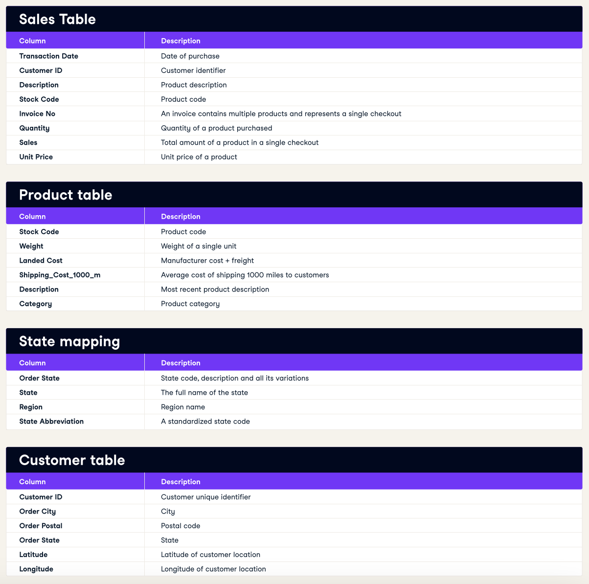
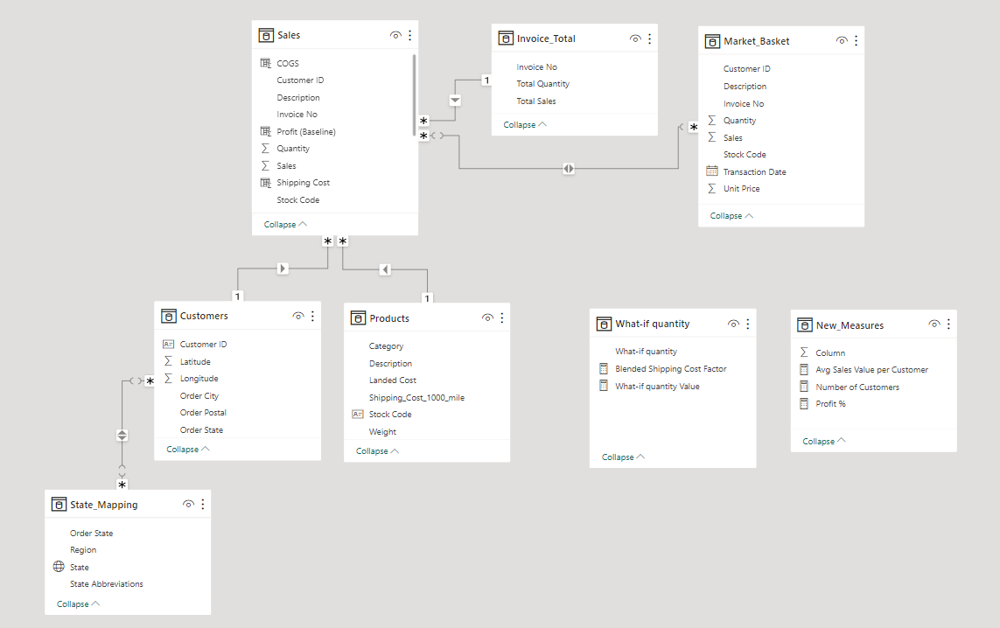
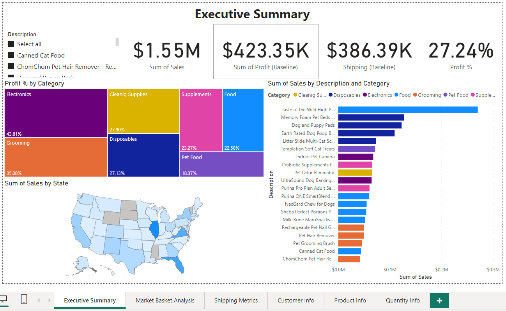
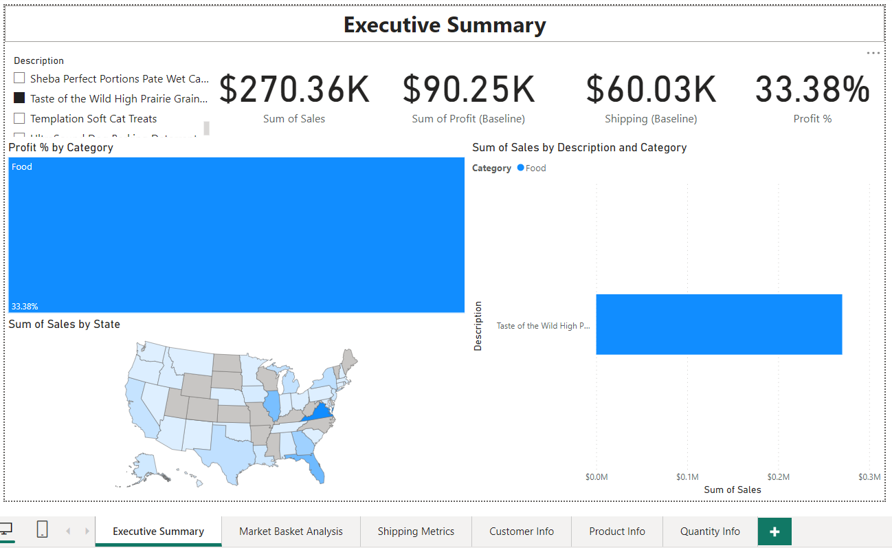
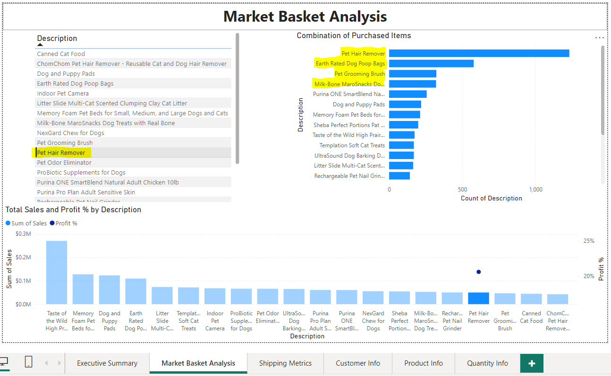
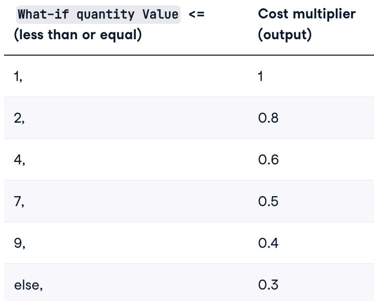
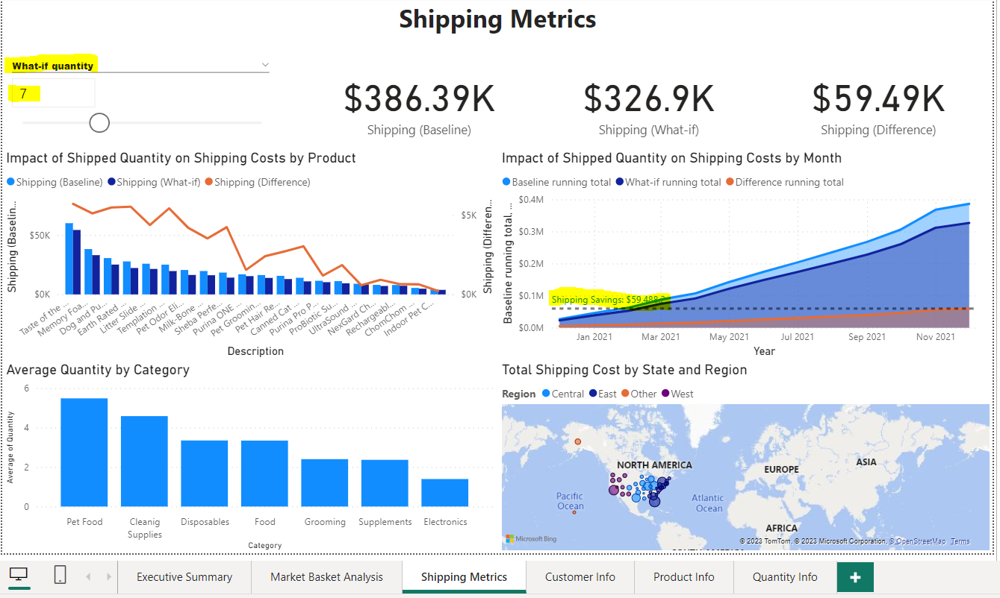

# PowerBI Case Study-Ecommerce

## Business Simulation

- In this case, we’ll analyze a business simulation of an online pet supply company called Whiskique via a fictitious e-commerce dataset.

## Dataset Description

- **fact_sales.csv** is the primary transaction table from December 2020 to the end of 2021.
- **dim_products.csv** contains additional attributes of products.
- **dim_customers.csv**  contains additional attributes of customers.
- **state_region_mapping.csv** has consistent values for locations.

## Model

## Key Points

- In the sheet of Executive Summary, we calculate Total Sales, Total Profit, Total Shipping Cost, and Profit Margin. Besides, we have a slicer of Product Descriptions to clarify the above metrics for each product.

Example: Detail of Taste of the Wild High Prairie Grain-Free Dry Dog Food 40 lb

- In the sheet of Market Basket Analysis, we find out what products are commonly purchased together. Assume that Whiskique wants to push sales of Pet Hair Remover, we realize that the the top 3  products that are usually purchased with Pet Hair Remover include Earth Rated Dog Poop Bags, Pet Grooming Brush, Milk-Bone Maro Snacks Dog Treats with Real Bone. Then some new promotion campaigns could be raised by a combination of these products.

  
&nbsp; &nbsp; &nbsp; &nbsp;
  
  
  

- In the sheet of Shipping Metrics, we find out the impact of shipped quantity on shipping costs.
    - Assume that due to a lack of automatic shipping cost capture at the transaction level, The shipping department has told you that shipping more than one quantity of an item costs, on average, 70% of the cost of a single-unit shipment.
        
        Shipping (Baseline) = SUMX(Sales, IF(Sales[Quantity]=1,Sales[Shipping Cost],Sales[Shipping Cost]+(((Sales[Quantity])-1)*(Sales[Shipping Cost]*0.7))))
        
    - After that, they supplied more detail data as below with What-if quantity is the fictitious average quantity of 1 type of product per invoice. They request us to add the impact of shipped quantity on shipping costs.
    

    
- Create a slicer to choose What-if quantity from 1 to 20.
- Blended Shipping Cost Factor is the cost multiplier
    
    Blended Shipping Cost Factor = IF('What-if quantity'[What-if quantity Value]<=1,1,IF('What-if quantity'[What-if quantity Value]<=2,0.8,IF('What-if quantity'[What-if quantity Value]<=4,0.6,IF('What-if quantity'[What-if quantity Value]<=7,0.5,IF('What-if quantity'[What-if quantity Value]<=9,0.4,0.3)))))
    
- Shipping (What-if) is the shipping cost with chosen What-if quantity
    
    Shipping (What-if) = SUMX(Sales,IF(Sales[Quantity]=1,Sales[Shipping Cost],Sales[Shipping Cost]+(((Sales[Quantity])-1)*(Sales[Shipping Cost]*[Blended Shipping Cost Factor]))))
    
- Shipping (Difference) is the Shipping Savings money
    
    Shipping (Difference) = [Shipping (Baseline)] - [Shipping (What-if)]
    
- Create Baseline running total, What-if running total, Difference running total
    
    Baseline running total = SUMX(FILTER(ALLSELECTED(Sales), Sales[Transaction Date] <=MAX(Market_Basket[Transaction Date])), [Shipping (Baseline)])
    
- Check the Area Map, Impact of Shipped Quantity on Shipping Cost by Month, assume that What-if quantity is 7, we will save $59,488.2 in total (12/2020 - 12/2021).

