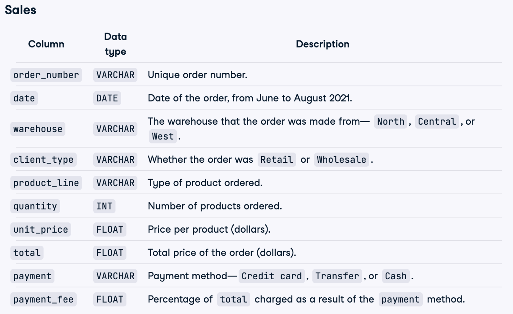
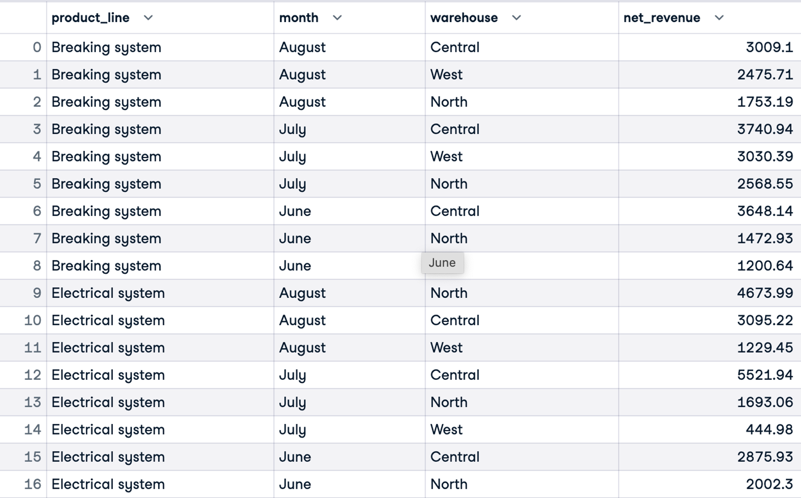
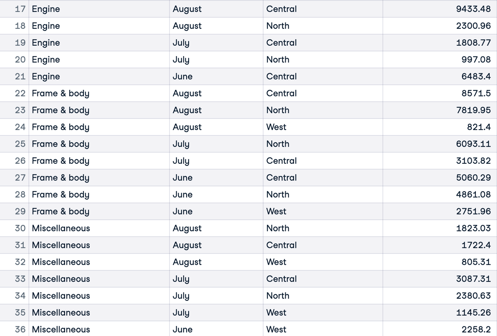

# Analyzing Motorcycle Part Sales

## Business Simulation
A company that sells motorcycle parts. They operate three warehouses in the area, selling both retail and wholesale. They offer a variety of parts and accept credit cards, cash, and bank transfers as payment methods. However, each payment type incurs a different fee.

They want to gain a better understanding of wholesale revenue by product line, and how this varies month-to-month and across warehouses.

I have been tasked with calculating wholesale net revenue for each product line and grouping results by month and warehouse.

## Data Description
The database contains the Sales table:



## Analyzing
```sql
SELECT product_line,
    CASE WHEN EXTRACT('month' from date) = 6 THEN 'June'
        WHEN EXTRACT('month' from date) = 7 THEN 'July'
        WHEN EXTRACT('month' from date) = 8 THEN 'August'
    END as month,
    warehouse,
    ROUND(SUM(total * (1 - payment_fee))::numeric, 2) AS net_revenue
FROM sales
WHERE client_type = 'Wholesale'
GROUP BY product_line, warehouse, month
ORDER BY product_line, month, net_revenue DESC
;
```


