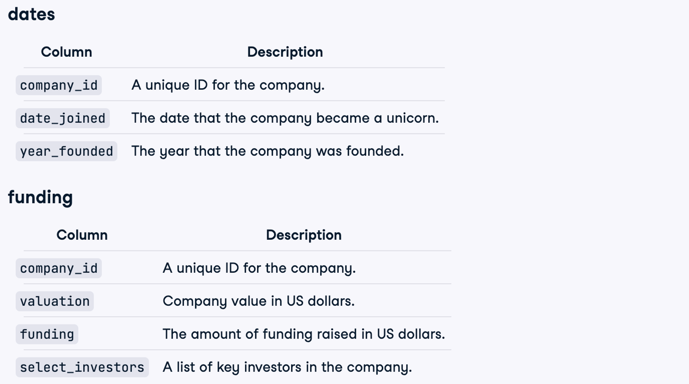
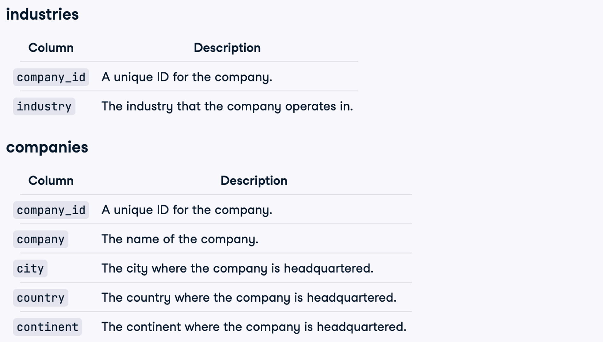
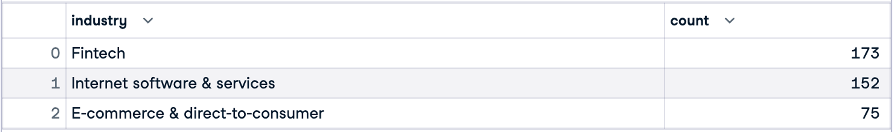
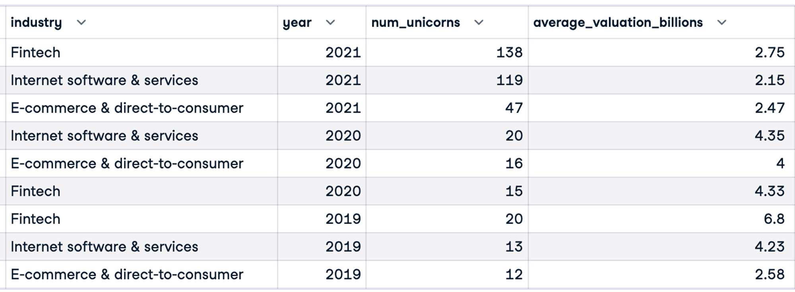
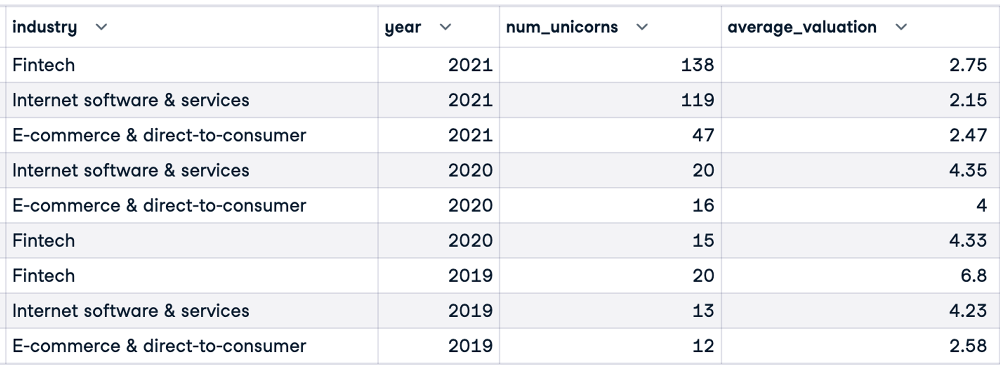

# Analyzing Unicorn Companies

## Business Simulation

Assume that I have been asked to support an investment firm by analyzing trends in high-growth companies. They are interested in understanding which industries are producing the highest valuations and the rate at which new high-value companies are emerging. Providing them with this information gives them a competitive insight as to industry trends and how they should structure their portfolio looking forward.

## Dataset Description

The Unicorns database contains 4 tables: dates, funding, industries, companies




## Analyzing

`Step 1: Top 3 industries having the largest total quantity of new unicorns in 3 years (2019-2021)`

```sql
SELECT i.industry, 
        COUNT(i.*)
    FROM industries AS i
    INNER JOIN dates AS d
        ON i.company_id = d.company_id
    WHERE EXTRACT(year FROM d.date_joined) in ('2019', '2020', '2021')
    GROUP BY industry
    ORDER BY count DESC
    LIMIT 3
;
```



`Step 2: All industries, their number of new unicorns, and their average valuation every year.`\\

(The result has 129 rows at all)

```sql
SELECT
    i.industry,
    EXTRACT(year FROM d.date_joined) AS year,
            COUNT(i.*) AS num_unicorns,
    AVG(f.valuation) AS average_valuation
    FROM industries AS i
    INNER JOIN dates AS d
        ON i.company_id = d.company_id
                INNER JOIN funding AS f
                    ON d.company_id = f.company_id
    GROUP BY industry, year
    ORDER BY year DESC, num_unicorns DESC
;
```


`Step 3: Top 3 industries above, their number of new unicorns, and their average valuation in 2019, 2020, and 2021`

- Method 1: Combine step 1 and step 2 to write the query.

```sql
WITH
-- Top 3 industries having the largest total quantity new unicorns in 3 years (2019-2021).

top_industries AS
	(
	SELECT i.industry, 
        COUNT(i.*)
    FROM industries AS i
    INNER JOIN dates AS d
        ON i.company_id = d.company_id
    WHERE EXTRACT(year FROM d.date_joined) in ('2019', '2020', '2021')
    GROUP BY industry
    ORDER BY count DESC
    LIMIT 3
	),

-- All industries, their number of new unicorns, and their average valuation in every year.

yearly_rankings AS 
	(
	SELECT
        i.industry,
        EXTRACT(year FROM d.date_joined) AS year,
		COUNT(i.*) AS num_unicorns,
        AVG(f.valuation) AS average_valuation
    FROM industries AS i
    INNER JOIN dates AS d
        ON i.company_id = d.company_id
    INNER JOIN funding AS f
        ON d.company_id = f.company_id
    GROUP BY industry, year
	  ORDER BY year DESC, num_unicorns DESC
	)
	
-- Top 3 industries above, their number of new unicorns, and their average valuation in 2019, 2020, and 2021
SELECT  industry,
		    year,
		    num_unicorns,
		 ROUND(AVG(average_valuation / 1000000000), 2) AS average_valuation_billions
	FROM yearly_rankings
	WHERE year in ('2019', '2020', '2021')
	     AND industry in (SELECT industry
	                      FROM top_industries)
	GROUP BY industry, num_unicorns, year
	ORDER BY year DESC, num_unicorns DESC
;
```




- Method 2: Use step 1 to write the query.

```sql
WITH
-- Top 3 industries having the largest total quantity of new unicorns in 3 years (2019-2021)

top_industries AS
	(
	SELECT i.industry, 
         COUNT(i.*)
    FROM industries AS i
    INNER JOIN dates AS d
        ON i.company_id = d.company_id
    WHERE EXTRACT(year FROM d.date_joined) in ('2019', '2020', '2021')
    GROUP BY industry
    ORDER BY count DESC
    LIMIT 3
	)

-- Top 3 industries above, their number of new unicorns, and their average valuation in 2019, 2020, and 2021
	SELECT
        i.industry,
        EXTRACT(year FROM d.date_joined) AS year,
		COUNT(i.*) AS num_unicorns,
        ROUND(AVG(f.valuation/1000000000),2) AS average_valuation
    FROM industries AS i
    INNER JOIN dates AS d
        ON i.company_id = d.company_id
			    INNER JOIN funding AS f
			        ON d.company_id = f.company_id
		WHERE  EXTRACT(year FROM d.date_joined) in ('2019', '2020', '2021')
			     AND industry in (SELECT industry
			                      FROM top_industries)
	  GROUP BY industry, year
		ORDER BY year DESC, num_unicorns DESC
	;
```

