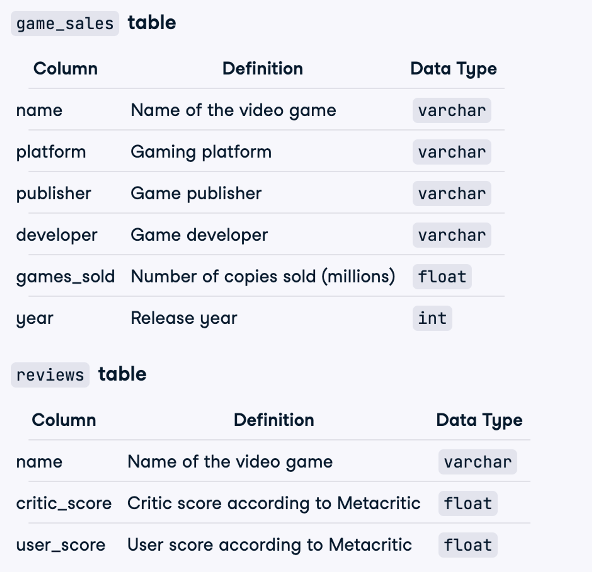
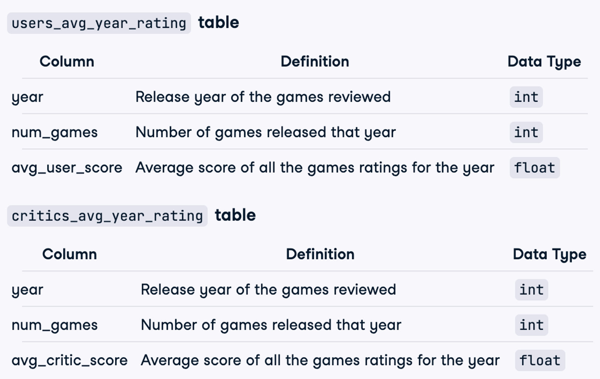
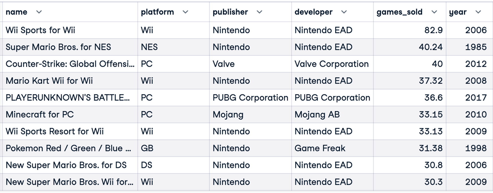
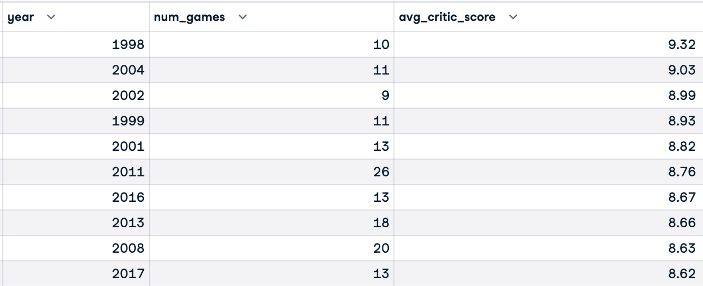
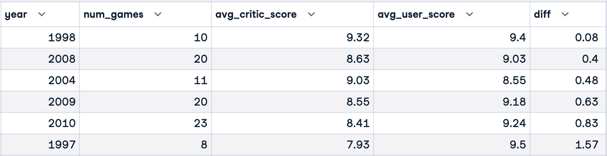

# The Golden Era Of Video Games

## Business Simulation

Video games are big business: the global gaming market is projected to be worth more than $300 billion by 2027 according to Mordor Intelligence. Are games getting better, or has the golden age of video games already passed?

In this project, I will analyze video game critic and user scores as well as sales data for the top 400 video games released since 1977 to search for a golden age of video games.

## Data Description

The database contains 4 tables: game_sales, reviews, users_avg_year_rating, critics_avg_year_rating.




## Analyzing

Find the ten best-selling games.

```sql
-- best_selling_games
SELECT *
FROM game_sales
ORDER BY games_sold DESC
LIMIT 10
;
```



Find the ten years with the highest average critic score, where at least four games were released (to ensure a good sample size).

```sql
-- critics_top_ten_years
SELECT g.year,
			COUNT(g.name) AS num_games,
			ROUND(AVG(r.critic_score),2) AS avg_critic_score
	FROM game_sales g
	INNER JOIN reviews r
		ON g.name = r.name
	GROUP BY g.year
	HAVING COUNT(g.name) > 4
	ORDER BY avg_critic_score DESC
	LIMIT 10
;
```



Find the years when critics and users broadly agreed that the games released were highly rated. Specifically, return the years where the average critic score was over 9 OR the average user score was over 9.

```sql
-- golden_years
SELECT u.year,
			u.num_games,
			c.avg_critic_score,
			u.avg_user_score,
			GREATEST(c.avg_critic_score, u.avg_user_score) - LEAST(c.avg_critic_score, u.avg_user_score) AS diff

	FROM critics_avg_year_rating c
	INNER JOIN users_avg_year_rating u
		ON c.year = u.year
	WHERE c.avg_critic_score > 9 OR u.avg_user_score > 9
	ORDER BY diff ASC
;
```


